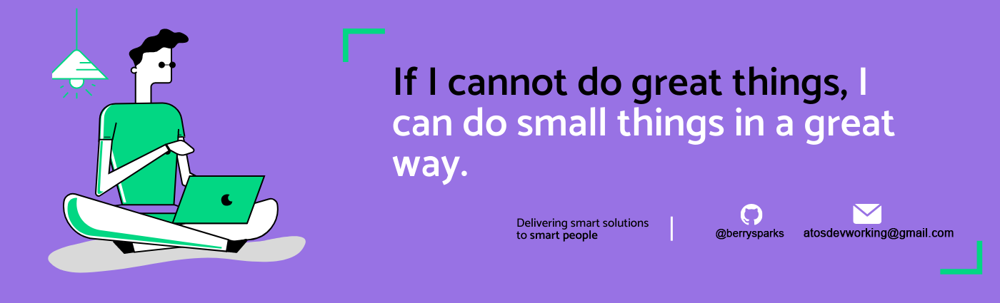

<h1 align="left">Hi 👋, I'm BerrySparks</h1>

  
  

 

## 👨🏻‍💻 About Me:

- 🙋‍♂️ All about me is at **[My Website](https://berry-peach.vercel.app)**

- 🔭 I’m currently working on `Something Intresting`.

- 🌱 I’m currently learning `MERN Stack`

- 👯 I’m looking to collaborate for `Dev Projects`

- 🤔 I’m looking for help with `Competitive Programming`

- 💬 Ask me about anything, Except Maths :sweat_smile:

- 👨‍💻 Life Hack: Learn new tech :fire: and share what you have learned :tada:

- ⚡ Fun fact: I waste most of my time playing games

## 🛠️ Technologies and Tools I use:

                    

## 📊 My GitHub Data:

  
  <!--  -->

